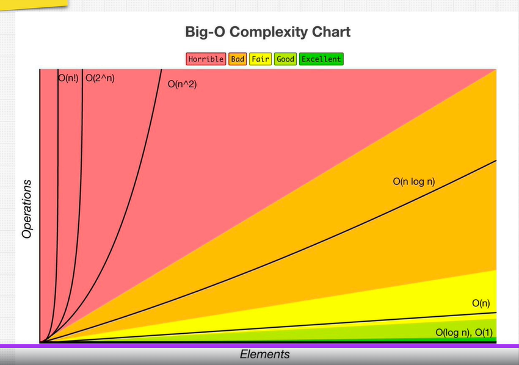
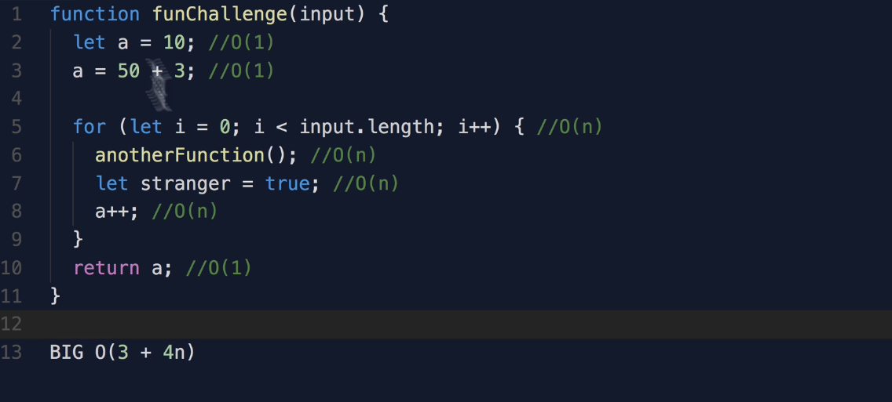
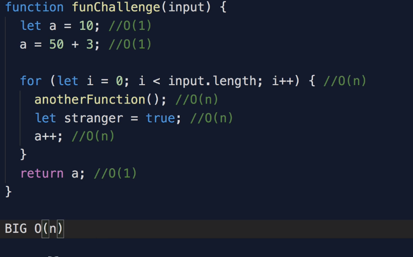
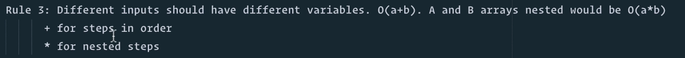
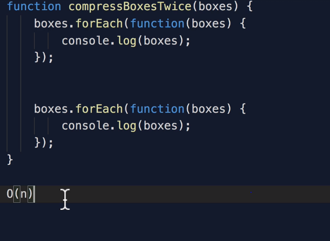
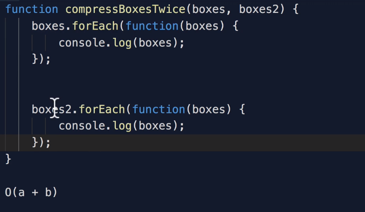
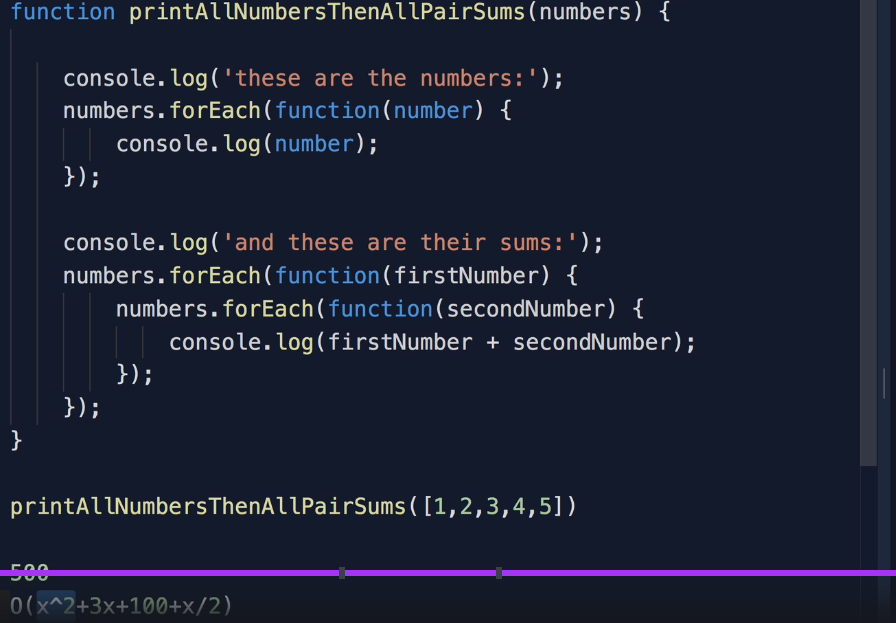
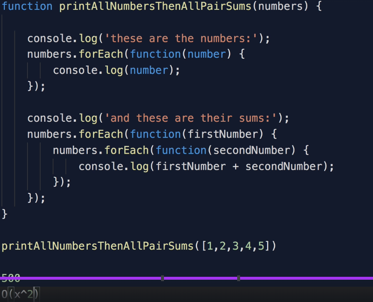
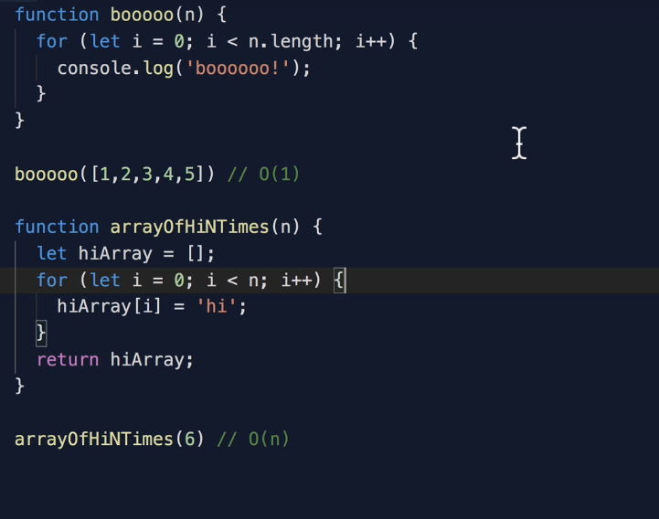

## Big O

cheatsheet - https://zerotomastery.io/cheatsheets/big-o-cheat-sheet/?utm_source=udemy&utm_medium=
https://www.bigocheatsheet.com/

## Good Code

Code shouls be Readable and Scalable.
We should select right Data Structure and right Algorithm.
Scalable - time and speed [Mostly there is always a trade off between speed and memory]

## Big O calculation

1. Worst case

2. Remove constants

3. Different terms for inputs
   O(n) or O(m+n) or O(m\*n)?
   
   

4. Drop non dominants
   
   

## Space complexity

We don't include the space taken by the inputs, we just consider an additional space taken.

## Sample Problem

'askhgfdsasdfgh'.legth
Its complexity depends on the language we are using.
In JS it is just a property on string so the complexity is O(1).
If if in other language, if it is a function that loop over a string to get length then the complexity will be O(n).

## Asymptotic Notations

Asymptotic Notations are mathematical tools used to analyze the performance of algorithms by understanding how their efficiency changes as the input size grows.
These notations provide a concise way to express the behavior of an algorithm’s time or space complexity as the input size approaches infinity.
By using asymptotic notations, such as Big O, Big Omega, and Big Theta, we can categorize algorithms based on their worst-case, best-case, or average-case time or space complexities, providing valuable insights into their efficiency.

There are mainly three asymptotic notations:
Big-O Notation (O-notation) - used for analyzing the worst-case complexity of an algorithm
Omega Notation (Ω-notation) - used for analyzing the best case complexity of an algorithm
Theta Notation (Θ-notation) - used for analyzing the average-case complexity of an algorithm
