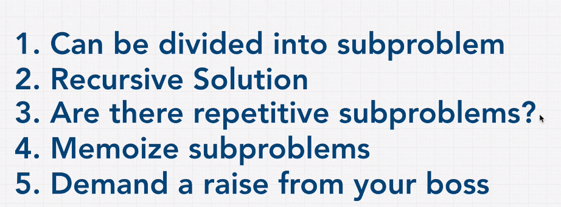

## Dynamic Programming

Dynamic programming is optimization technique using caching.
Usually breaks down a problem into sub-problems and storing there solutions if by any chance that sub-problem appears again.

Dynamic Programming uses,
Divide and conquer + Memoization

## Memoization

Simple Example:

Without Memoization -
function add(val){
return val+50
}
add(5)
add(5)
add(5)

With Memoization -
let cache = []
function add(val){
if(cache[val]){
return cache[val]
}else{
console.log('Complex calculations which takes long time...')
cache[val] = val+50
return cache[val]
}
}
add(5)
add(5)
add(5)
