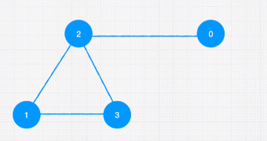

## Graphs

Includes nodes and edges.

Real time applications:
Internet - world wide web
Friendships/family tree
Facebook uses for networking
Amazon uses for recommendation engines
Google maps to get shortest path

## Types of graphs:

Directed - one way [twitter]
Undirected - 2 way [facebook]

Weighted - edges have weight/values
Unweighted

Cyclic - there is loop present
Acyclic

## Representing Graphs:

Edge List:
const graph = [[0,2], [2,3], [2,1], [1,3]]

Adjacent List:
const graph = [[2], [2,3], [0,1,3], [1,2]]
0 is connectd to 2
1 is connected to 2 and 3
2 is connected to 0,1 and 3
3 is connected to 1 and 2

Adjacent Matrics:
const graph = [
[0,0,1,0],
[0,0,1,1],
[1,1,0,1],
[0,1,1,0]
]
or
const graph = {
0: [0,0,1,0],
1: [0,0,1,1],
2: [1,1,0,1],
3: [0,1,1,0]
}
0 is connectd to 2
1 is connected to 2 and 3
2 is connected to 0,1 and 3
3 is connected to 1 and 2

## Benefits and Disadvantages:

Considering performance or Big O graphs are not too good, but they are best to show relational data.
Graphs are complicated and scaling is hard.
