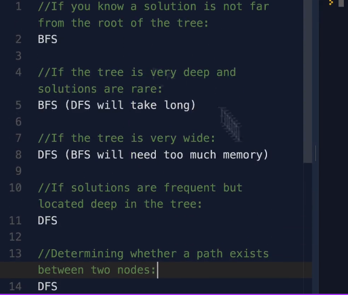

## Linear Search

The linear search algorithm is defined as a sequential search algorithm that starts at one end and goes through each element of a list until the desired element is found; otherwise, the search continues till the end of the dataset.

Time Complexity: O(n)
Space Complexity: O(1)

## Binary Search

Binary Search Algorithm is a searching algorithm used in a sorted array by repeatedly dividing the search interval in half. The idea of binary search is to use the information that the array is sorted and reduce the time complexity to O(log N).

Time Complexity: O(log n)

## Traversing Tree or Graph

DFS - Depth First Search
BFS - Breadth First Search

## BFS

Level Order Traversal technique is defined as a method to traverse a Tree such that all nodes present in the same level are traversed completely before traversing the next level.

Breadth First Search (BFS) for a Graph:
Breadth First Search (BFS) is a graph traversal algorithm that explores all the vertices in a graph at the current depth before moving on to the vertices at the next depth level. It starts at a specified vertex and visits all its neighbors before moving on to the next level of neighbors. BFS is commonly used in algorithms for pathfinding, connected components, and shortest path problems in graphs.

Relation between BFS for Graph and BFS for Tree:
Breadth-First Traversal (BFS) for a graph is similar to the Breadth-First Traversal of a tree .

The only catch here is, that, unlike trees , graphs may contain cycles, so we may come to the same node again. To avoid processing a node more than once, we divide the vertices into two categories:
Visited and
Not visited.

Time Complexity: O(n)

Good to get shortest path, closer nodes but requires more memory.

## DFS

DFS (Depth-first search) is a technique used for traversing trees or graphs. Here backtracking is used for traversal. In this traversal first, the deepest node is visited and then backtracks to its parent node if no sibling of that node exists

In the graph, there might be cycles and disconnectivity. Unlike the graph, the tree does not contain a cycle and are always connected. So DFS of a tree is relatively easier. We can simply begin from a node, then traverse its adjacent (or children) without caring about cycles. And if we begin from a single node (root), and traverse this way, it is guaranteed that we traverse the whole tree as there is no dis-connectivity,

Time Complexity: O(n)

Uses less memory, good to determine if the path exists or not. But it might get slow.

## Time and Space complexity

BFS:

Time complexity is O(|V|), where |V| is the number of nodes. You need to traverse all nodes.
Space complexity is O(|V|) as well - since at worst case you need to hold all vertices in the queue.

DFS:

Time complexity is again O(|V|), you need to traverse all nodes.
Space complexity - depends on the implementation, a recursive implementation can have a O(h) space complexity [worst case], where h is the maximal depth of your tree.
Using an iterative solution with a stack is actually the same as BFS, just using a stack instead of a queue - so you get both O(|V|) time and space complexity.

(\*) Note that the space complexity and time complexity is a bit different for a tree than for a general graphs becase you do not need to maintain a visited set for a tree, and |E| = O(|V|), so the |E| factor is actually redundant.

## When to use BFS and when DFS?

## DFS - Inorder, Preorder, Postorder

Inorder - left, root, right
Preorder - root, left, right [we can recretae tree easily if we have data in preorder]
Postorder - left, right, root

## Dijkstra

Useful to get shortest path or work on weighted graphs.
With negative edge values it will not work.
But it is more efficient and fastest as compared to Bellman-Ford algorithm.

## Bellman-Ford

Useful to get shortest path or work on weighted graphs.
We can get shortest path even if edges have negative values.
Complexity: O(n^2) [It is slower in worst case as compared to Dijkstra]
