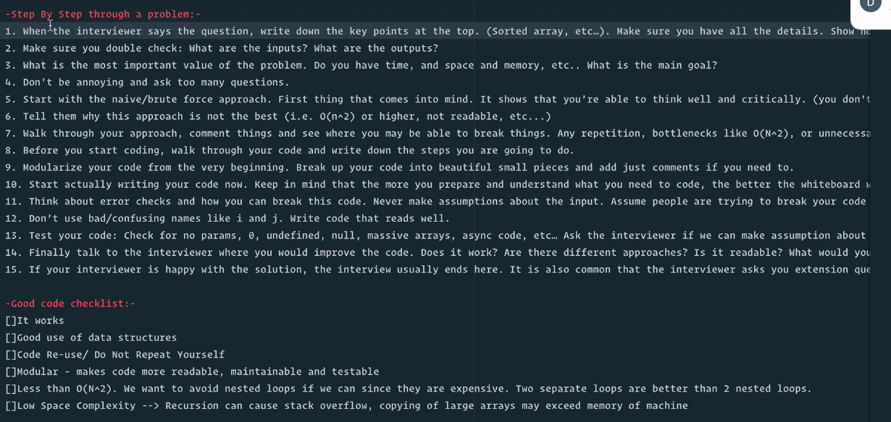

## Skills

Analytical + Coding + Technical + Communication

## Data Structures

Arrays
Stacks
Queues
Linked Lists
Trees
Tries
Graphs
Hash Tables

## Algorithms

SOrting
Dynamic Programming
BFS + DFS (Searching)
Recursion

## Solving problem

## Memory

RAM:
When we write a code we declare variables or data structure, it get saved in RAM. [When computer turned off, it will get deleted]
RAM is closer to the CPU, it executes the code faster. It can access any random address from the RAM.
CPU also has a cache memory to further enhance the performance.

Storage:
While files, audios, videos are saved in storage i.e. hard disk, flash disk, etc. [It will not get deleted even if we turn off the computer]

## In-built data structures in JavaScript

## Operation we perform on Data Structures

Insertion
Deletion
Searching
Sorting
Traversal
Access
