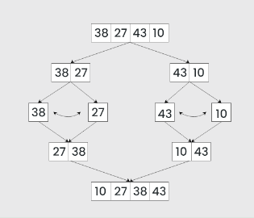

##

As input values are huge, we need to choose right sorting algorithm to sort it efficiently.

## In-built sort()

arr.sort()
arr.sort((a,b) => a-b)
arr.sort((a,b) => a.localeCompare(b))

## In JS, if we are using default sort function Chrome's V8 Engine uses Insertion Sort if data set is small else it uses Quick Sort

## Bubble Sort

Bubble Sort is the simplest sorting algorithm that works by repeatedly swapping the adjacent elements if they are in the wrong order. This algorithm is not suitable for large data sets as its average and worst-case time complexity is quite high.

In Bubble Sort algorithm,
traverse from left and compare adjacent elements and the higher one is placed at right side.
In this way, the largest element is moved to the rightmost end at first.
This process is then continued to find the second largest and place it and so on until the data is sorted.

Time Complexity: O(n^2)
Space Complexity: O(1)

## Selection Sort

The algorithm repeatedly selects the smallest (or largest) element from the unsorted portion of the list and swaps it with the first element of the unsorted part. This process is repeated for the remaining unsorted portion until the entire list is sorted.

Time Complexity: O(n^2)
Space Complexity: O(1)

## Difference between Bubble sort and Selection sort

In bubble sort we do swapping between adjacent elements, but in selection sort we select and smallest/largest element and then place it to the right position [one time swap]

## Insertion Sort

It is more efficient if the list is already partially sorted.

Insertion sort is a simple sorting algorithm that works by iteratively inserting each element of an unsorted list into its correct position in a sorted portion of the list. It is a stable sorting algorithm, meaning that elements with equal values maintain their relative order in the sorted output.

Insertion sort is like sorting playing cards in your hands. You split the cards into two groups: the sorted cards and the unsorted cards. Then, you pick a card from the unsorted group and put it in the right place in the sorted group.

In Insertion Sort algorithm,
We have to start with second element of the array as first element in the array is assumed to be sorted.
Compare second element with the first element and check if the second element is smaller then swap them.
Move to the third element and compare it with the second element, then the first element and swap as necessary to put it in the correct position among the first three elements.
Continue this process, comparing each element with the ones before it and swapping as needed to place it in the correct position among the sorted elements.
Repeat until the entire array is sorted.

Time Complexity: O(n^2)
Space Complexity: O(1)

## Merge Sort

Merge sort is a popular sorting algorithm known for its efficiency and stability. It follows the divide-and-conquer approach to sort a given array of elements.

Divide: Divide the list or array recursively into two halves until it can no more be divided.
Conquer: Each subarray is sorted individually using the merge sort algorithm.
Merge: The sorted subarrays are merged back together in sorted order. The process continues until all elements from both subarrays have been merged.

Time Complexity: O(n log(n)), theta(n log(n))
Space Complexity: O(n)

## Quick Sort

Time Complexity: O(n^2), theta(n log(n))
Space Complexity: O(log(n))

## Heap Sort

https://brilliant.org/wiki/heap-sort/
https://stackoverflow.com/questions/2467751/quicksort-vs-heapsort

Time Complexity: O(n log(n))
Space Complexity: O(1)

## Radix Sort

https://brilliant.org/wiki/radix-sort/
https://www.cs.usfca.edu/~galles/visualization/RadixSort.html

Time Complexity: O(nk)
Space Complexity: O(n+k)

## Counting Sort

https://brilliant.org/wiki/counting-sort/
https://www.cs.usfca.edu/~galles/visualization/CountingSort.html

Time Complexity: O(n+k)
Space Complexity: O(k)

## What is stability in Sorting Algorithms?

A sorting algorithm is said to be stable if two objects with equal keys appear in the same order in sorted output as they appear in the input array to be sorted. Some sorting algorithms are stable by nature like Insertion sort, Merge Sort, Bubble Sort, etc. And some sorting algorithms are not, like Heap Sort, Quick Sort, etc.

Background: a "stable" sorting algorithm keeps the items with the same sorting key in order. Suppose we have a list of 5-letter words:

peach
straw
apple
spork
If we sort the list by just the first letter of each word then a stable-sort would produce:

apple
peach
straw
spork
In an unstable sort algorithm, straw or spork may be interchanged, but in a stable one, they stay in the same relative positions (that is, since straw appears before spork in the input, it also appears before spork in the output).

We could sort the list of words using this algorithm: stable sorting by column 5, then 4, then 3, then 2, then 1. In the end, it will be correctly sorted. Convince yourself of that. (by the way, that algorithm is called radix sort)

Now to answer your question, suppose we have a list of first and last names. We are asked to sort "by last name, then by first". We could first sort (stable or unstable) by the first name, then stable sort by the last name. After these sorts, the list is primarily sorted by the last name. However, where last names are the same, the first names are sorted.

## When to use which algorithm?

Insertion Sort - If the data set is small and mostly sorted data

Bubble sort, Selection sort - We usually don't use it in real time sorting

Merge Sort - Large data set and if always want to sort in less time

Quick Sort - Large data set and if we can compromise on worst case time complexity but want to use memory efficiently

Heap Sort - Best in all, less time and space complexity

## Comparison Sort

Bubble sort
Insertion sort
Selection sort
Merge sort
Quick sort

## Non Comparison Sort

Radix sort - we can use it if data set is fixed length integers

Counting sort - we can use it if data set is fixed length integers
