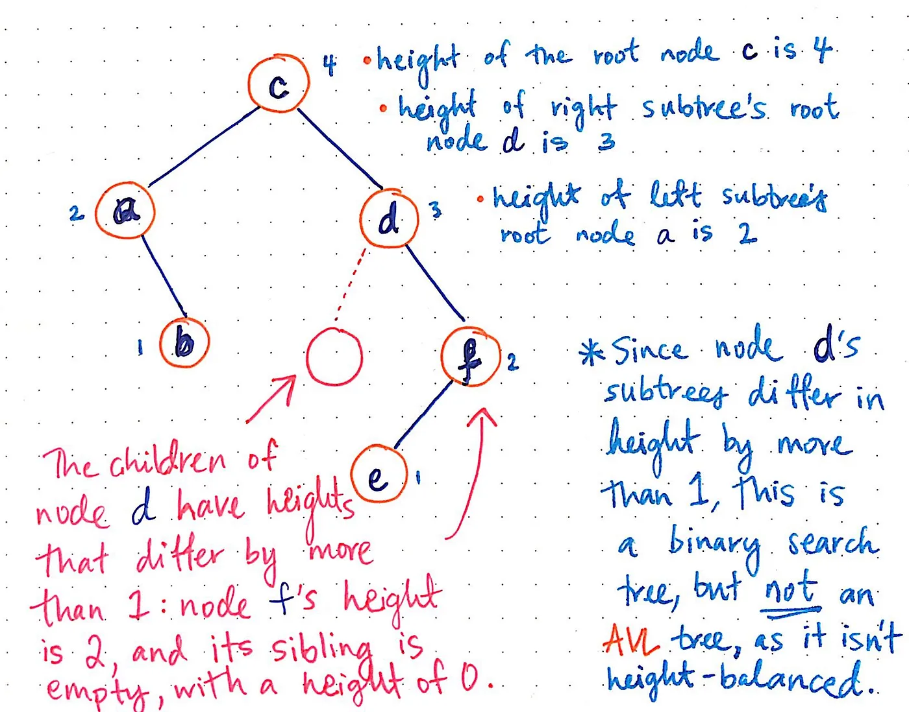

https://medium.com/basecs/the-little-avl-tree-that-could-86a3cae410c7

Binary trees are incredibly powerful because of their logarithmic runtime, which is exactly what makes them so fast and efficient.
The moment that a binary tree becomes unbalanced, it loses its efficiency.

In the best-case scenario, run in O(log n) time, which means that even as a tree grows, searching through the tree for one particular node is still pretty fast because, at each level, we cut out half of the tree as we search through it. This is makes the tree logarithmic. And the logarithmic nature of BST’s only applies and can only be maintained if they are balanced.

## Balanced Tree and Height-Balanced Tree:

Not AVL tree -

Converting BST to height balanced AVL tree -

The logic for how we rearranged those nodes stems from the balancing formula that every AVL tree will adhere to: if the subtrees of a node has heights h1 and h2, then the absolute value of the difference of those two heights must be less than or equal to (≤) 1. In other words, the difference between the heights of two subtrees in an AVL tree should never exceed 1 level.

When it comes to AVL trees, there are two main types of rotations to use in order to rearrange nodes in a tree and do the hard work of self-balancing: single rotations and double rotations.
Single rotations are by far the simplest way to rebalance an unbalanced tree. There are two types of single rotations: a left rotation and a right rotation. A left rotation is useful if a node is inserted into the right subtree of another, higher up node’s right subtree, and that insertion or a deletion causes a tree to become unbalanced.

Sometimes, however, a single rotation just won’t cut it. In those scenarios, desperate times call for double rotations: namely, either a left-right rotation, or a right-left rotation.

A left-right rotation is a combination of a left rotation, followed by a right rotation. In the examples shown here, we perform a left-right double rotation on the tree with a root node 3, a left subtree with a node 1, with its own right subtree and a node of 2. Once we perform a left rotation on the left subtree, our tree is a little easier to deal with. Our tree has transformed from 3–1–2 into 3–2–1. We’re back to something familiar: a left subtree of a left subtree. Since we already know how to handle those kinds of trees, we can easily perform a right rotation on the left subtree, so that 2 is now the new root nodes, and 1 and 3 are its children.
Conversely, a right-left rotation is the exact same thing, but in the reverse order. A right-left rotation is a combination of a right rotation followed by a left rotation.
