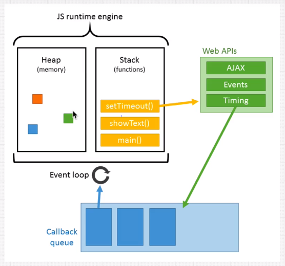
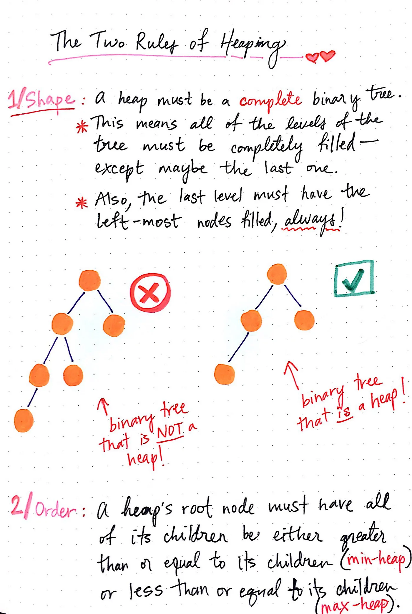
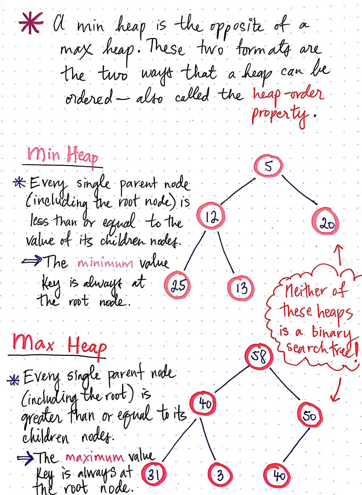
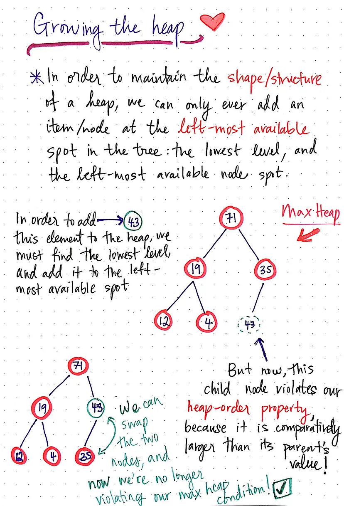
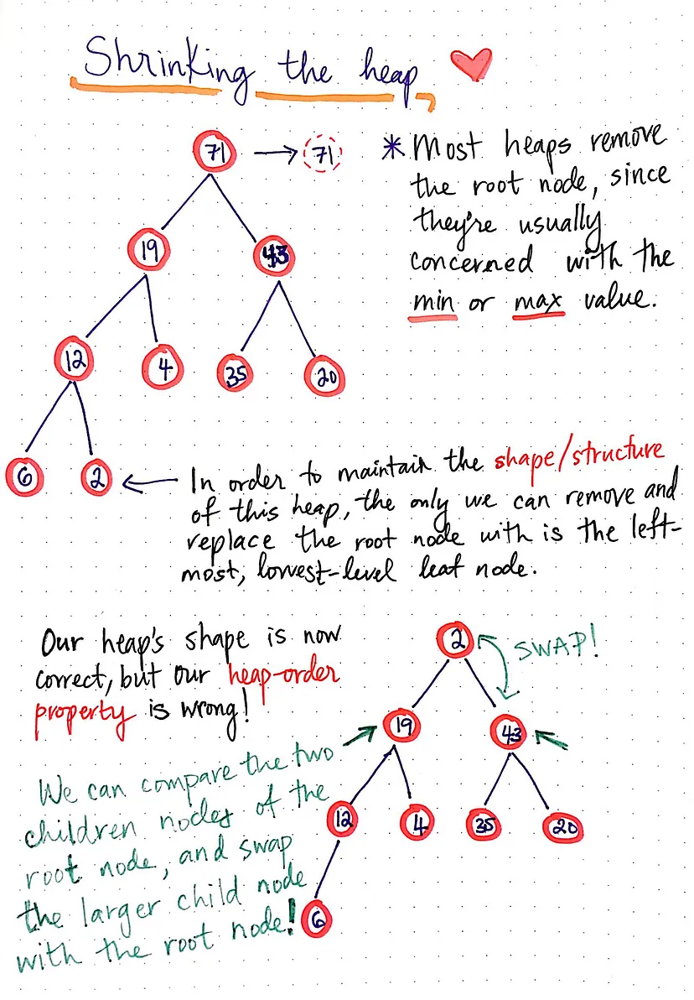
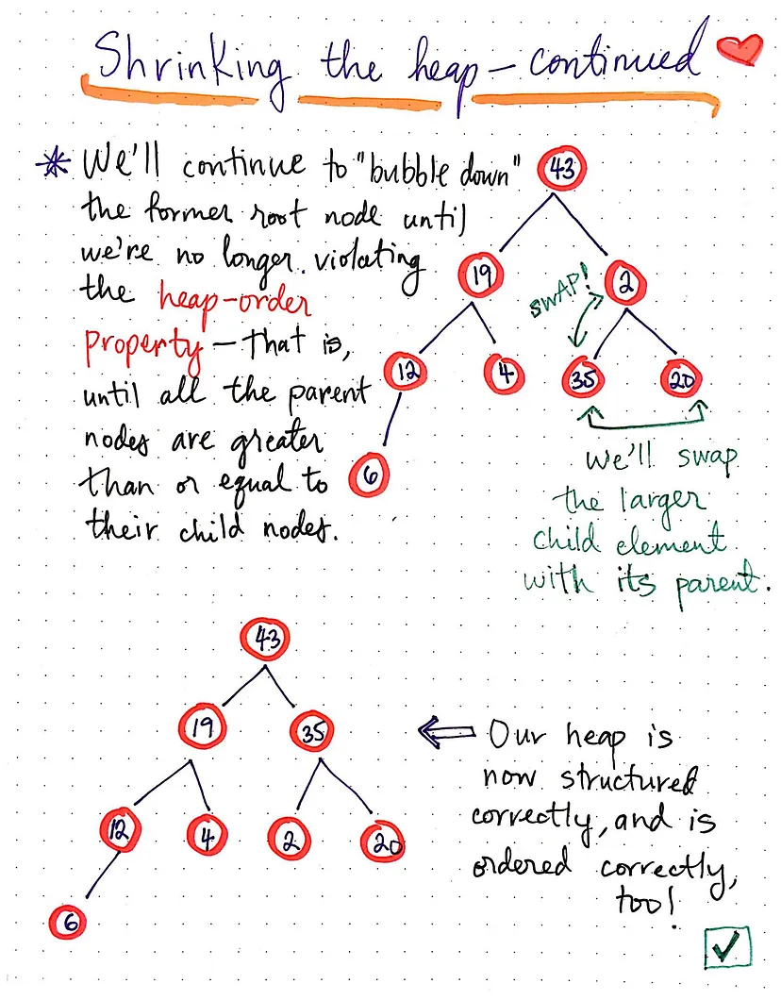
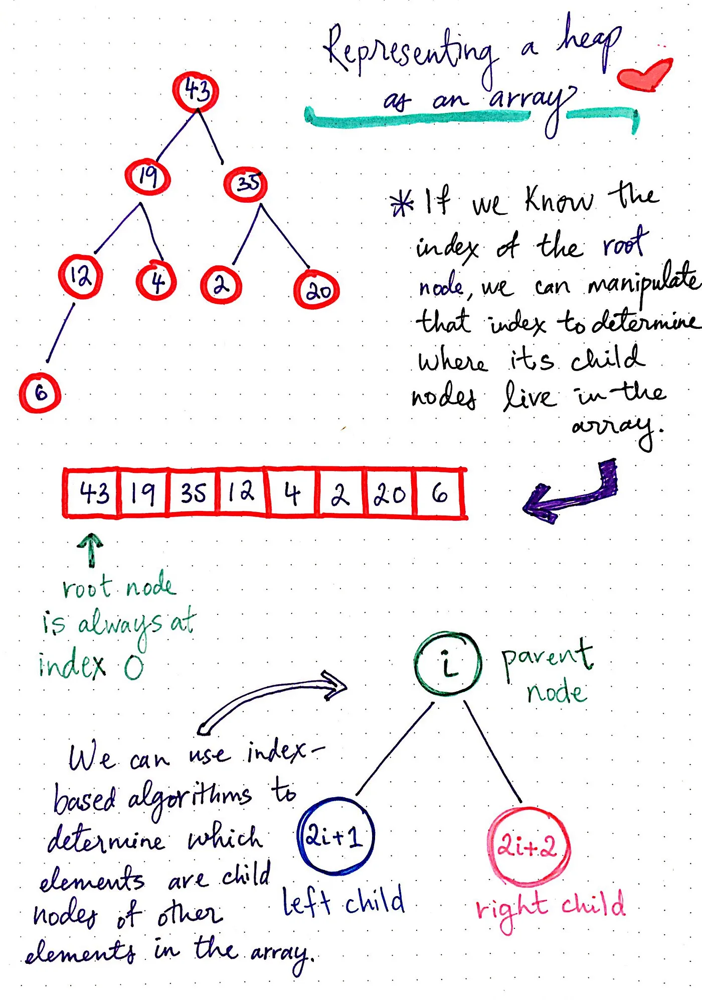
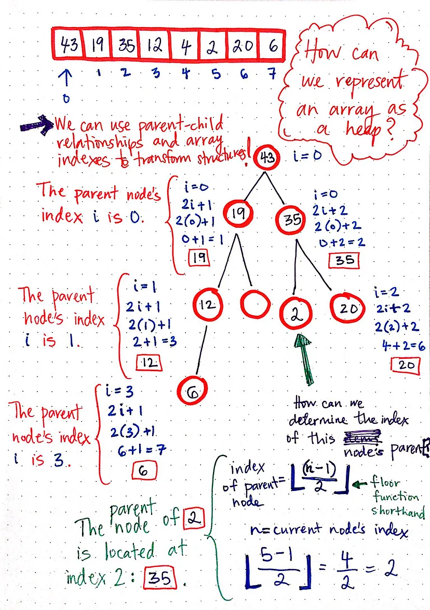

## Heap Data Structure and Heap Memory

They have the same name but they really aren't similar (even conceptually). A memory heap is called a heap in the same way you would refer to a laundry basket as a "heap of clothes". This name is used to indicate a somewhat messy place where memory can be allocated and deallocated at will. The data structure (as the Wikipedia link you reference points out) is quite different.

Memory Heap != Heap Data Structure

JS Runtime Engine has heap and stack memory. Heap is a fre storage, where we store arbitary data.

## Binary Heap

All of the levels of the tree must be completely filled, except may be the last one. Also, the last most level must have the left-most nodes filled, always.
A heap's root node must have all of it's children be either greater than or equal to it children or less than or equal to it's children.

## Min Heap or Max Heap

Min Heap - A min heap is a heap where every single parent node, including the root, is less than or equal to the value of its children nodes.
Max Heap - Every parent node, including the root, is greater than or equal to the value of its children nodes.

## Growing and shrinking a heap

When growing a heap, we can only ever add a node to the left-most available spot in the tree; that is to say, the left most available node, at the lowest possible level.

When deleting or removing an element, most heaps are usually concerned with removing the root node, since the root will always be either the largest value element or the smallest value element, depending upon whether the heap is a max heap or min heap.

##

The heaps are partially sorted data structures; there is an element of “ordering” to them, but they’re also not completely sorted in the way that a binary search tree would be. However, the most import aspect of a heap is that the maximum or minimum value element is always the root node.

Why we need to represent heap as arrays at all! It’s because of queues!
Queues are data structures that follow the first-in, first-out (FIFO) principle, and are used in tons of places: managing requests, jobs, CPU scheduling, are just a few examples.
