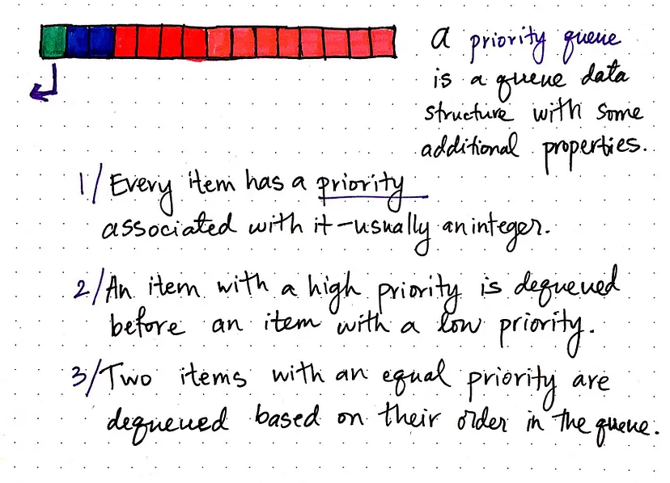
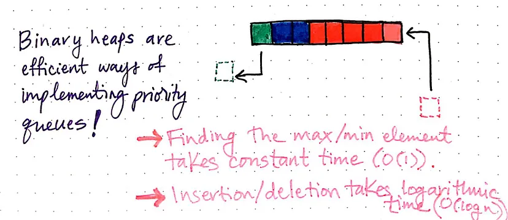

## Priority Queues

Heaps are often implemented as arrays because they are super efficient ways of representing priority queues.

A priority queue is a queue data structure with some additional properties. Every item in a priority queue has a “priority” associated with (usually a numerical value). An item with a high priority is dequeued before an item with a lower priority.
If two items have the same priority, they’re dequeued based on their order in the queue; in other words, they’re removed according to their location in the array.

Binary heaps are super efficient for implementing priority queues because it’s very easy to know and retrieve/remove the element with the highest priority: it will always be the root node!

This one specific characteristic of heaps that we’ve been referencing repeatedly is exactly what makes heaps the data structure of choice when it comes to priority queues!
Finding the maximum of minimum value element takes a constant amount of time, which makes it efficient to dequeue an item.
Similarly, because of their binary tree structure, adding or removing an element takes logarithmic time, since we eliminate half of the possible nodes with each level that we traverse to add/delete an element.
