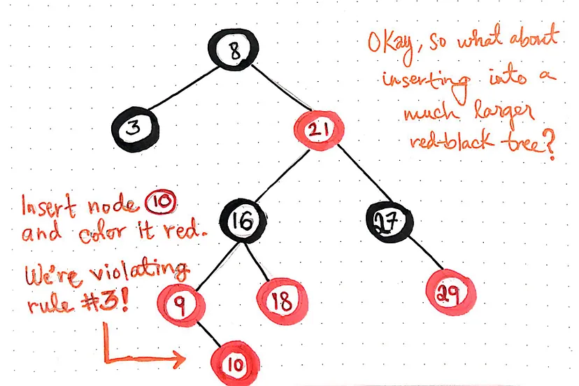
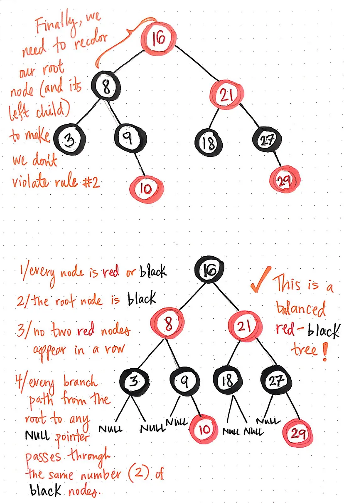

https://medium.com/basecs/painting-nodes-black-with-red-black-trees-60eacb2be9a5

A red-black tree is a type of self-balancing binary search tree, very similar to other self-balancing trees, such as AVL trees. However, a red-black tree is a structure that has to adhere to a very strict set of rules in order to make sure that it stays balanced; the rules of a red-black tree are exactly what enables it to maintain a guaranteed logarithmic time complexity.

Generally speaking, the four rules of a red-black tree are always presented in the same order, as follows:
Every single node in the tree must be either red or black.
The root node of the tree must always be black.
Two red nodes can never appear consecutively, one after another; a red node must always be preceded by a black node (it must have a black parent node), and a red node must always have black children nodes.
Every branch path — the path from a root node to an empty (null) leaf node — must pass through the exact same number of black nodes. A branch path from the root to an empty leaf node is also known as an unsuccessful search path, since it represents the path we would take if we were to search for a node that didn’t exist within the tree.

Inserting a node and immediately coloring it red makes it much easier to identify and subsequently fix any violations.

Another handy trick for handling rule violations is: rotations! We can do something similar when it comes to red-black trees, too.

The benefits of painting it black:
Okay, so we managed to recolor and rotate enough in our first example to get things perfectly balanced and working correctly.
But, what about inserting elements into a much larger red-black tree? Let’s walk through a more complicated example; as we’ll see, the same methods apply.

The key to dealing with larger red-black trees is moving any rule violations up the tree as we go.

Time and Space complexity:
Inserting and deleting from a red-black tree takes O(log n) amount of time, since the maximum height of a red-black tree is the same as a perfectly-balanced binary search tree: logarithmic time.
Adding a color to a node takes a constant amount, O(1), of time, because it only involves changing a single pointer.
Rotating and recoloring nodes in order to fix any broken rules takes a constant amount, O(1), of time, since all we’re really doing is, again, rearranging pointers. However, as we saw with our last tree example, we could have to rotate and recolor nodes all the way up to the tree’s height. The height of the tree is logarithmic, O(log n), which, multiplied by the amount of work to rotate/recolor, O(1), still ends up being O(log n) in total.
ed-black tree is that the average and worst-case scenario to search, insert, and delete from the tree is always O(log n) time, guaranteed. The space complexity of a red-black tree is no different from a BST, and depends on the number of total nodes: O(n).

Compared to AVL trees, red-black trees are less-perfectly balanced. However, we generally need fewer rotations during insertion/deletion with a red-black tree, which makes red-black trees superior for growing or shrinking a free, but less efficient for searching compared to AVL trees.

The best example of a red-black trees in use today is the Linux kernel’s Completely Fair Scheduler (CFS), which was introduced as recently as 2007. This scheduler handles resource allocation for executing process from within the CPU, and actually uses red-black trees under the hood!

However, tracking the color of a node requires only 1 bit of storage. We might remember learning about bits, bytes, and binary earlier in this series; a bit is a single binary digit, which, in the grand scheme of things, is a super minuscule amount of space to store either the color red or black. Part of the reason that a bit is sufficient is because the tree can only have two possible colors, so it is enough to store a reference to one of those colors, associated with each node, in such a small amount of space.

