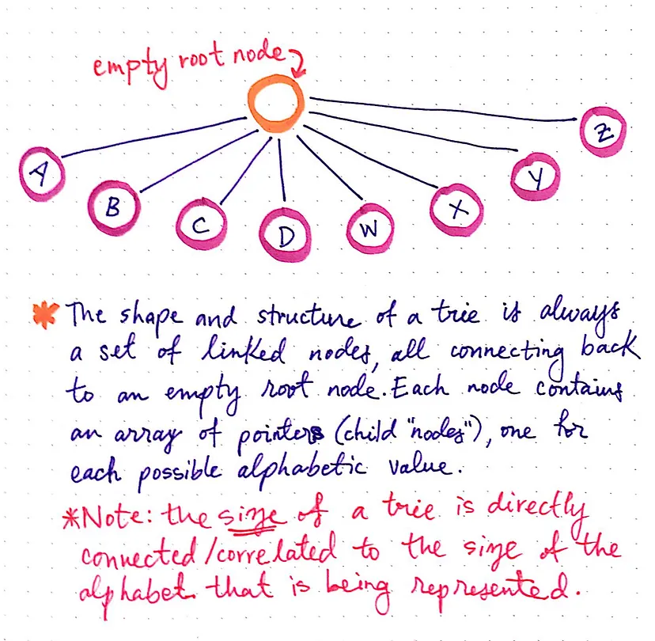
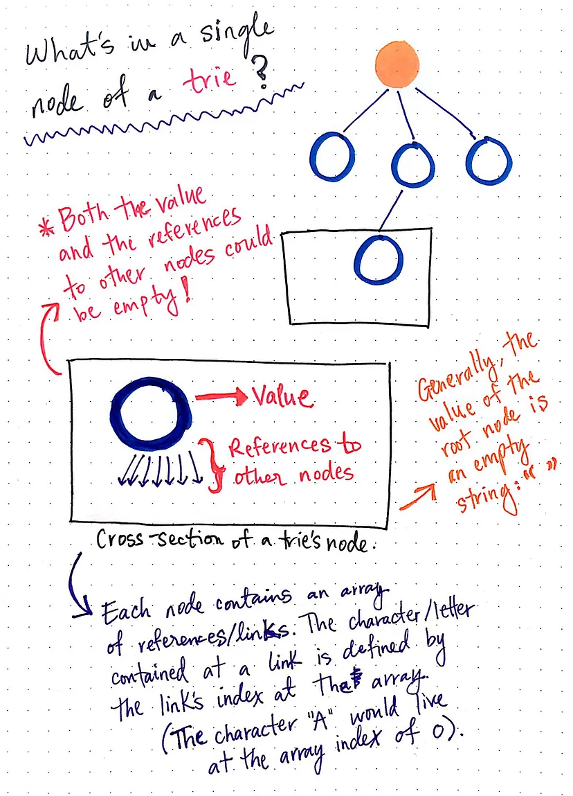

A trie is a tree-like data structure whose nodes store the letters of an alphabet. By structuring the nodes in a particular way, words and strings can be retrieved from the structure by traversing down a branch path of the tree.

The shape and the structure of a trie is always a set of linked nodes, connecting back to an empty root node. An important thing to note is that the number of child nodes in a trie depends completely upon the total number of values possible. For example, if we are representing the English alphabet, then the total number of child nodes is directly connected to the total number of letters possible. In the English alphabet, there are 26 letters, so the total number of child nodes will be 26.

Imagine, however, that we were creating a trie to hold words from the Khmer (Cambodian) alphabet, which is the longest known alphabet with 74 characters. In that case, the root node would contain 74 links to 74 other child nodes.

A single node in a trie contains just two things:
A value, which might be null
An array of references to child nodes, all of which also might be null

When a trie representing the English language is created, it consists of a single root node, whose value is usually set to an empty string: "".
That root node will also have an array that contains 26 references, all of which will point to null at first. As the trie grows, those pointers start to get filled up with references to other nodes nodes.

The way that those pointers or references are represented is particularly interesting. We know that each node contains an array of references/links to other nodes. What’s cool about this is that we can use the array’s indexes to find specific references to nodes. For example, our root node will hold an array of indexes 0 through 25, since there are 26 possible slots for the 26 letters of the alphabet. Since the alphabet is in order, we know that the reference to the node that will contain the letter A will live at index 0.

https://medium.com/p/3ec6bede0014
