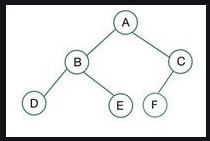

## Trees

It is a non-linear, heirarchical data structure.
Examples: Implementation of chess game, showing family relations.

## Binary tree

Each node can have at most 2 children.
The topmost node in a binary tree is called the root, and the bottom-most nodes are called leaves.

## Full binary tree

A full binary tree is a binary tree with either zero or two child nodes for each node.

## Degenerate binary tree

Every non-leaf node has just one child in a binary tree known as a Degenerate Binary tree. The tree effectively transforms into a linked list as a result, with each node linking to its single child.

## Complete binary tree

A complete binary tree is a special type of binary tree where all the levels of the tree are filled completely except the lowest level nodes which are filled from as left as possible.

## Balanced binary tree

The height of the left and right tree for any node does not differ by more than 1.
The left subtree of that node is also balanced.
The right subtree of that node is also balanced.

## Perfect binary tree

All leaf nodes are at the maximum depth of the tree, and the tree is completely filled with no gaps.
Each level have double nodes of the previous level.
Each parent have 2 childs.
Last level nodes = total number of nodes of all above levels + 1

Number of nodes in a level : 2^level [level starts from 0]

total number of nodes : 2^height - 1

Often used in the implementation of heap data structures.
Used in the implementation of algorithms such as heapsort and merge sort.

## Binary search tree

Right child's value > Parent's value > Left child's value
This allows for efficient Searching, Insertion, and Deletion operations on the data stored in the tree.
The left and right subtree each must also be a binary search tree.  
There must be no duplicate nodes(BST may have duplicate values with different handling approaches)

Handling duplicate values in the Binary Search Tree:
We must follow a consistent process throughout i.e. either store duplicate value at the left or store the duplicate value at the right of the root, but be consistent with your approach.

Commonly used to implement efficient searching, insertion, and deletion operations.
BSTs allow for efficient searching by repeatedly dividing the search space in half, which makes it an important data structure in computer science and many other fields.

A BST supports operations like search, insert, delete, floor, ceil, greater, smaller, etc in O(h) time where h is height of the BST. To keep height less, self balancing BSTs (like AVL and Red Black Trees) are used in practice. These Self-Balancing BSTs maintain the height as O(Log n). Therefore all of the above mentioned operations become O(Log n). Together with these, BST also allows sorted order traversal of data in O(n) time.

A Self-Balancing Binary Search Tree is used to implement doubly ended priority queue.

Applications of Binary Search Tree (BST):
Searching: Finding a specific element in a sorted collection
Sorting: Sorting a collection of elements in ascending or descending order
Range queries: Finding elements within a specified range
Data storage: Storing and retrieving data in a hierarchical manner
Databases: Indexing data for efficient retrieval
Computer graphics: Representing spatial data in a tree structure
Artificial intelligence: Decision trees and rule-based systems

Advantages of Binary Search Tree (BST):
Efficient searching: O(log n) time complexity for searching
Ordered structure: Elements are stored in sorted order, making it easy to find the next or previous element
Dynamic insertion and deletion: Elements can be added or removed efficiently
Balanced structure: Balanced BSTs maintain a logarithmic height, ensuring efficient operations
Space efficiency: BSTs store only the key values, making them space-efficient

Disadvantages of Binary Search Tree (BST):
Not self-balancing: Unbalanced BSTs can lead to poor performance
Worst-case time complexity: In the worst case, BSTs can have a linear time complexity for searching and insertion
Memory overhead: BSTs require additional memory to store pointers to child nodes
Not suitable for large datasets: BSTs can become inefficient for very large datasets
Limited functionality: BSTs only support searching, insertion, and deletion operations

## Balanced vs Unbalanced BST

Balanced BST:
lookup - O(log N)
insert - O(log N)
delete - O(log N)

Unbalanced BST:
lookup - O(n)
insert - O(n)
delete - O(n)

## Binary Search Tree vs Array vs Hash Table

Considering it is balanced:
It is better than O(n), ordered, flexible size but no O(1) operations.
Lookup, Insert and Delete is faster as compared to an array.
As compared to Hash Table, the data is sorted and have parent-child relationship.
